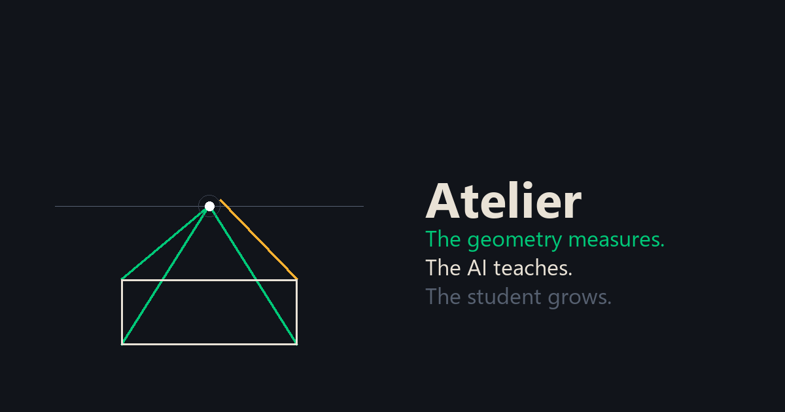
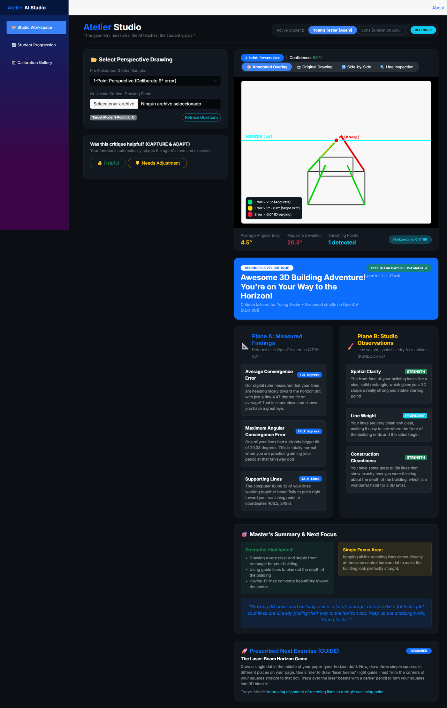
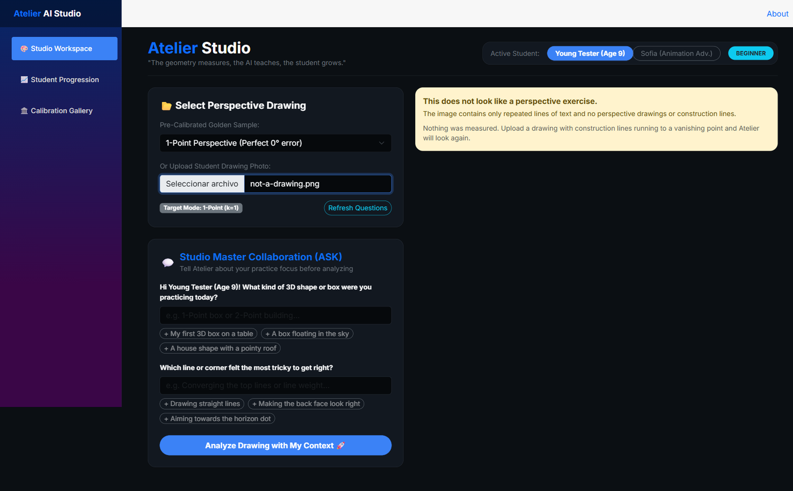
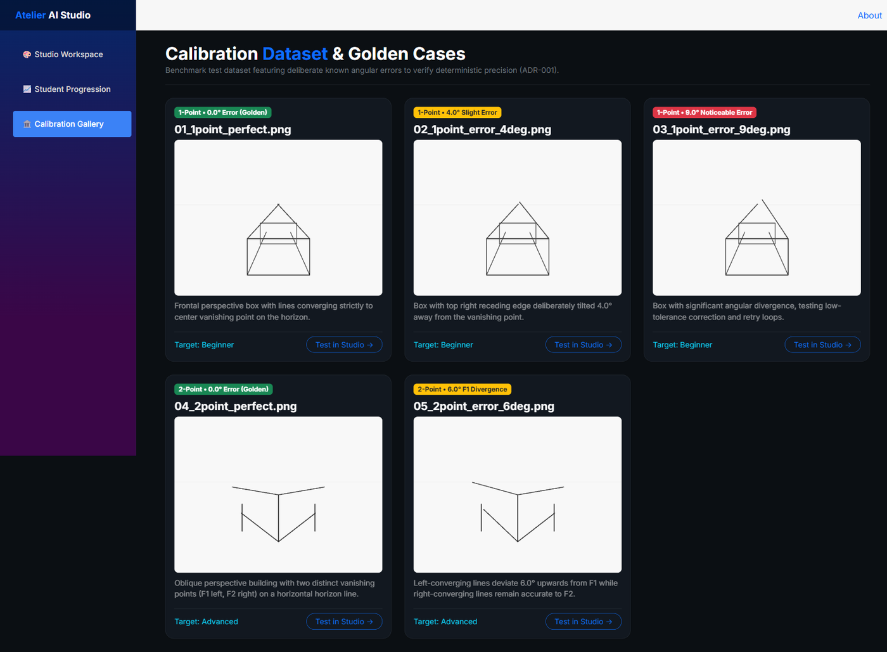
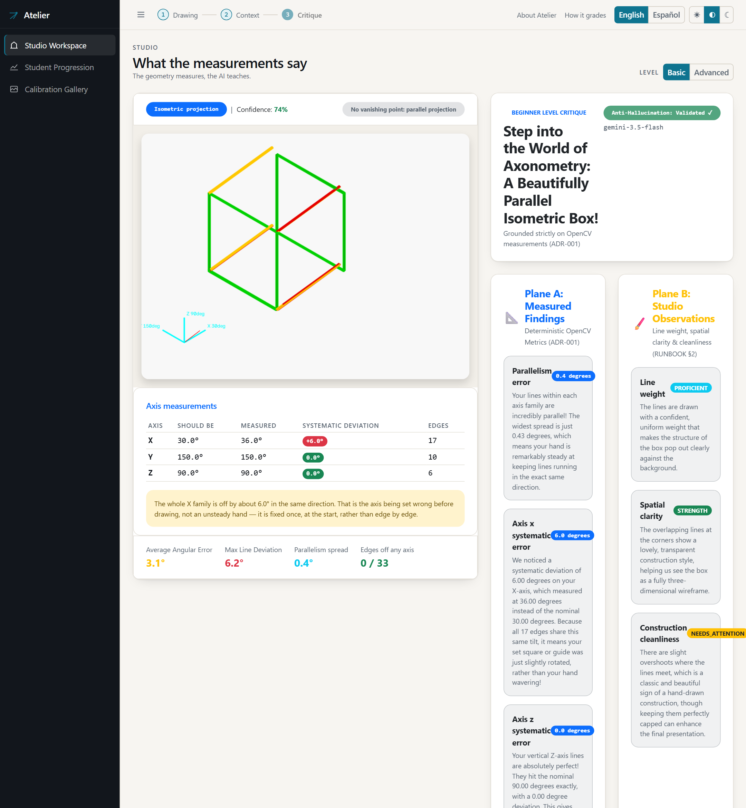
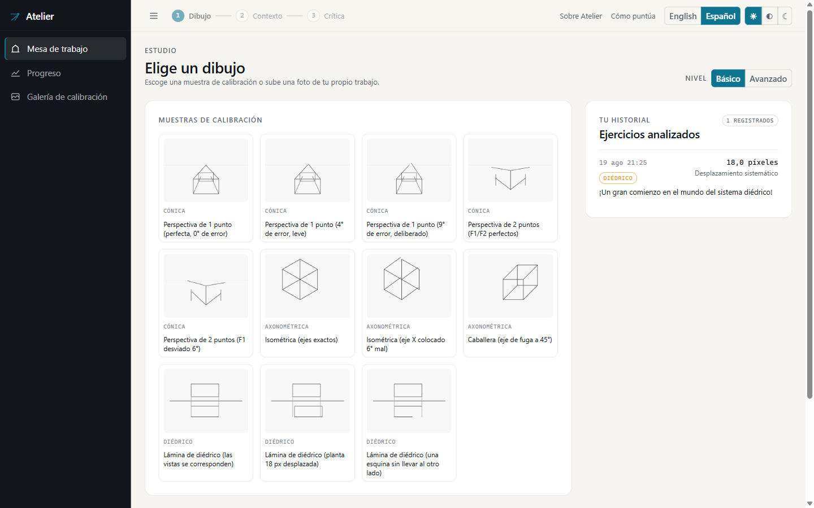
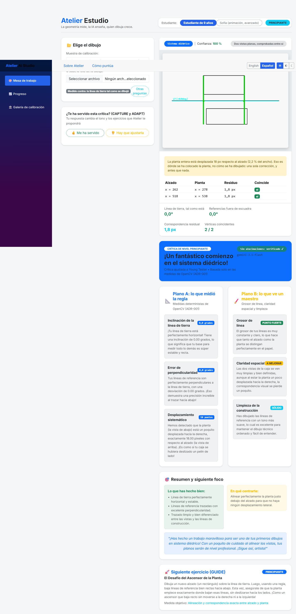
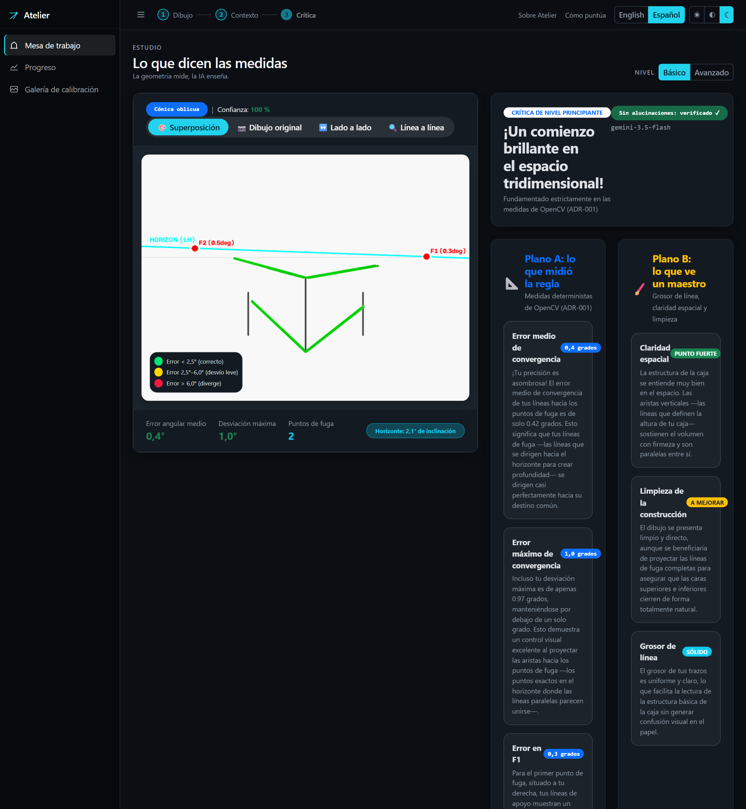
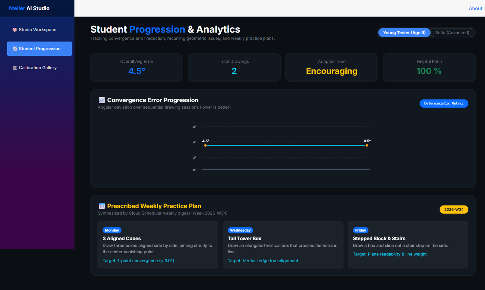
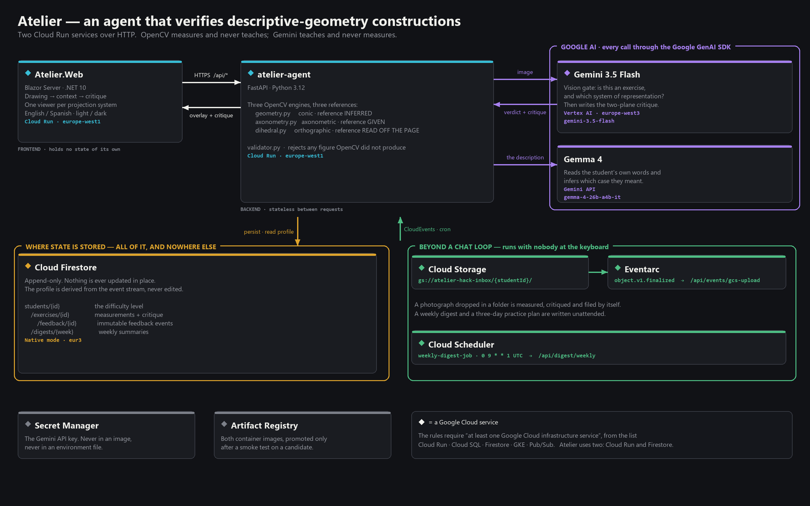

# Atelier — an agent that verifies descriptive-geometry constructions



> *"The geometry measures, the AI teaches, the student grows." (ADR-001)*

[](LICENSE)
[](https://dotnet.microsoft.com/)
[](https://python.org/)
[](https://cloud.google.com/)
[](https://pypi.org/project/google-genai/)
[](https://deepmind.google/technologies/gemini/)

**Atelier** verifies technical drawings in **descriptive geometry** — *sistemas de representación*,
the Monge tradition taught as a first-year subject in architecture, engineering and animation
degrees.

That discipline has a property most drawing subjects do not: **correctness is objective**. An
isometric axis is at 30° or it is not; a point's plan lies on the reference line dropped from its
elevation or it does not. And yet across **eighteen published syllabi and rubrics**
([`docs/PEDAGOGY.md`](docs/PEDAGOGY.md)) **not one states a numerical tolerance.** The discipline
defines correctness exactly and then hands the checking to a person with a set square at the end of
a stack of plates — which is slow, and which is why a student working remotely waits days to learn
that one edge missed by eight degrees.

Atelier pairs **deterministic OpenCV computer vision** — vanishing points, axis angles, ground-line
correspondence, per-line angular error in degrees — with **Gemini 3.5 Flash on Vertex AI**, which
teaches but is **forbidden from producing a number**. A validator enforces it.

> **It automates the objective verification the discipline already defines. It does not invent a new
> criterion.**

---

## ✅ Mandatory Stack Compliance (Hackathon Requirements)

| Requirement | How Atelier satisfies it | Where |
| :--- | :--- | :--- |
| **Gemini 3.5+ via Gemini API or Vertex AI** | Gemini 3.5 Flash on Vertex AI (critique + dialogue) | [`atelier-agent/src/tools/critique.py`](atelier-agent/src/tools/critique.py) |
| **≥1 Google Agent Framework** | Google GenAI SDK (`google-genai`) — every model call | [`atelier-agent/requirements.txt`](atelier-agent/requirements.txt) · [`src/tools/`](atelier-agent/src/tools/) |
| **≥1 Google Cloud infrastructure service** | **Cloud Run** and **Firestore** (both on the rules' enumerated list) · plus Cloud Storage, Eventarc and Cloud Scheduler | [`infra/`](infra/) · [`src/tools/`](atelier-agent/src/tools/) |

---

## 🌐 Live Demo & Hosted Deployment

- 💻 **Studio Web Client (Blazor / .NET 10)**: `https://atelier-web-773993294789.europe-west1.run.app`
- 🤖 **Agent Backend API (Google GenAI SDK + FastAPI / Cloud Run)**: `https://atelier-agent-773993294789.europe-west1.run.app`
- 📚 **Interactive Swagger API Docs**: `https://atelier-agent-773993294789.europe-west1.run.app/docs`

> 💡 *Note on Cold Starts*: To conserve Google Cloud student budget, Cloud Run services scale to 0 instances when idle. The initial load request may take ~5-10 seconds to spin up containers.

---

## What it looks like

Every figure in these screenshots was measured by the deployed system, and every screenshot
was taken against it rather than assembled. Nothing here is a mockup.

Three of the four systems of representation are measured, and the useful thing about having them
together is that **they differ in where the reference comes from** — which sets a ceiling on how far
each result can be trusted:

| System | Where the reference comes from | How far it can be trusted |
|---|---|---|
| **Conic** | **Inferred.** RANSAC estimates a vanishing point from the student's own lines | Weakest. A consistently wrong drawing yields a vanishing point that agrees with it, and the reported error shrinks — there is a worked example of exactly that below |
| **Orthographic** (*sistema diédrico*) | **Read off the page.** The ground line is a line the student drew | Middle. Nothing is guessed, but a crooked ground line skews everything, so its tilt is reported as a figure in its own right |
| **Axonometric** | **Given.** The axes are constants of the projection system | Strongest. Nothing is estimated at all; an error injected at 6.00° comes back at 6.00° |

The fourth, **contoured planes** (*sistema de planos acotados*), needs the numeric annotations
read off the page — OCR
rather than line geometry — and is documented as not implemented.

### The studio



The drawing on the left is `03_1point_error_9deg.png`, built with a deliberate nine-degree error
on one receding edge. The engine reports **4.5° average, 20.3° worst line** — and selecting the
perfect sample instead reports **0.8° / 2.5°**. The number moves with the drawing, which is the
only interesting property a measurement can have.

The green **Anti-Hallucination: Validated** badge appears only when Gemini actually answered.
When the model is unreachable the same panel shows an amber *"Deterministic fallback — no model
answered"* instead, with the real `model_version` beneath it. The badge is earned per critique,
not painted on.

### When it refuses



A shopping list, uploaded by mistake. Before any measurement, Gemini 3.5 Flash looks at the page
and answers two questions: *is this an exercise at all*, and *which system of representation is
it?* Here the first answer is no, and it says why in its own words — *"The image is a plain text
shopping list and does not contain any technical drawing or geometric construction."*

**Nothing is measured, and nothing is critiqued.** Without this gate the page would go through
RANSAC, find a vanishing point among whatever edges exist, and spend real tokens telling a student
their line weight is confident. Measuring the wrong thing carefully is worse than declining to
measure it.

The refusal appears on **step one**, where the upload happened. That is worth saying because it did
not always: the three status messages lived only in the results panel, which step one does not
render, so a rejected upload looked like nothing at all had happened. The strongest argument the
project has was invisible for a day.

### The calibration set



Eleven synthetic drawings across **all three** systems, each carrying an error of a known size —
and each labelled with the system it belongs to, because that decides what it is measured against.
They are the benchmark the golden tests assert against: the conic detector must recover the
vanishing point to within one pixel of where it was drawn and must rank 0° below 4° below 9°; the
axonometric and orthographic cases must return their injected error to within 0.05° and 1 px.

### The other projection system



The same page, a different drawing, and a different reference. `07_isometric_error_6deg.png` has
every edge of the X family drawn at 36° instead of 30° — a set square placed wrong, not an unsteady
hand — and the table names exactly that: **nominal 30.0°, measured 36.0°, systematic +6.0°**, while
Y and Z come back at 0.0°.

That split is the point. A single average of 3.1° would say "slightly inaccurate" and leave the
student sanding every edge. Separating *systematic* from *per-line* deviation says something a
published rubric cannot: the hand was steady, the axis was set wrong, and the fix happens once
before drawing rather than edge by edge. Gemini reaches that conclusion from the payload on its
own — *"Because all 17 edges share this same tilt, it means your set square or guide was just
slightly rotated, rather than your hand wavering"* — and the critique contains no mention of a
vanishing point, because there is no vanishing point in this drawing and the rubric forbids
inventing one. The parallelism spread is 0.4°, and **0 of 33 edges fall off any axis**: nothing was
dropped to make the average look better.

### The studio, step by step



Three steps — **drawing → context → critique** — with the indicator in the top bar and a rail that
collapses to icons. Step one is choosing: the page analyses nothing until a drawing is picked,
because a three-step flow that starts on step two is not a flow.

Each sample carries the projection system it belongs to, because that decides what it is measured
against. The history beside them is the reader's own: every past exercise with its system, the one
figure worth showing, and the headline of the critique that was written at the time. A figure that
was not measurable renders as a dash — never as zero.

The profile is a **difficulty level**, not a person. It sets the register of the rubric and the tone
of the critique, and nothing downstream interpolates a name into anything.

### The third system: two flat views



Not a picture of a solid at all — an orthographic plate (*sistema diédrico*): an elevation above
the ground line,
a plan below it, and reference lines carrying each vertex across. What is measured here is neither
convergence nor parallelism but **correspondence**: a point in one view must have its counterpart
directly below it in the other.

The plan in this plate is drawn correctly and *placed* 18 px to the right. Every vertex inherits
that, so a naive reading reports a broken corner at each one. Atelier reports one fact —
**the plan sits 18 px sideways from the elevation, 2.2% of the page** — removes it, and then checks
what is left: 1.8 px of residual, **2 of 2 vertices agreed**, no orphans. The two mistakes it
separates need different corrections:

| Reading | What went wrong | What the student does |
|---|---|---|
| Systematic offset, no orphans | The plan was **placed** wrong on the page | Move it once, before anything else |
| Orphan vertex | A corner was **never carried across** the ground line | Redraw the construction |

The hard part of correspondence, in principle, is knowing which mark in the plan belongs to which
vertex in the elevation. The engine never solves it and does not need to: in orthographic
projection corresponding points share an abscissa, so comparing the two views' sets of vertex
abscissae answers the question without pairing a single feature.

**Heights and depths are not measured** — *cotas* and *alejamientos*. Those need a third view and
real feature
correspondence, and claiming them from two views would be inventing.

### In the student's language



A two-point plate, in Spanish and in the dark theme. Everything below the headline was written by
Gemini **in** Spanish because the interface language travels with the request — the critique is not
translated afterwards, and the numbers are the same ones OpenCV produced. Note `0,4°` rather than
`0.4°`: the culture drives number formatting too, so the measurement reads the way the student
writes it.

Metric names, unit words and the strength/needs-attention statuses are identifiers the validator
matches on, so they stay in English on the wire and are looked up for display. An identifier with
no translation falls through to itself, which is readable English rather than a blank.

**This screenshot also shows the weakest link in the system, and it is worth reading carefully.**
The drawing is `05_2point_error_6deg.png` — a plate whose F1 was deliberately drifted by six
degrees. The panel reports an average convergence error of **0,4°** (`0.42°` off the API). The
*perfect* two-point plate, `04_2point_perfect.png`, reports **0.48°**. The drawing with the injected
fault scores *better* than the one without it.

That is not a defect in the arithmetic. It is what *inferred* reference means: RANSAC estimates the
vanishing points from the lines the student actually drew, so a consistently drifted drawing yields
a pair of vanishing points that agree with it, and the residual against them is small. The fault
does surface — as **2.08° of horizon tilt**, against −0.51° for the correct plate — because two
vanishing points estimated from a drifted construction no longer sit on a level horizon.

This is exactly why the three systems are ranked in the table above, and why the ranking is in the
documentation rather than buried. An axonometric drawing cannot do this: its axes are constants of
the projection, so there is nothing for a wrong drawing to bend.

### The progression



Read from Firestore, not from a fixture. **16 drawings, 5.5° overall average**, tone adapted to
*encouraging* from the feedback events, helpful ratio 100%. The counts are low because they are
real — every exercise on this page was produced by analysing an actual drawing through the deployed
agent, and the curve is jagged for the same reason.

The curve plots **conic exercises only**. An average axis deviation and an average convergence
error are both measured in degrees and are not the same quantity; one line through both would show
progress or regression nobody made. The weekly practice plan appears on this page when a Cloud
Scheduler digest exists for the student — absent rather than faked when it does not.

---

## 🏛️ System Architecture



*Generated by [`docs/make_architecture_diagram.py`](docs/make_architecture_diagram.py) — every
region, model id, bucket and trigger on it is a value read out of the code, so it cannot drift from
the system it describes.*

**[`docs/COMPONENTS.md`](docs/COMPONENTS.md) answers what a diagram cannot**: why each component is
here rather than the obvious alternative, and which requirement it satisfies — including the ones
that were rejected, and why. ADK, Cloud SQL, Pub/Sub, one service instead of two, and asking the
model for the measurements.

<details>
<summary>The same architecture as text, for reading at a terminal</summary>

```text
┌───────────────────────────────────────────────────────────────────────────────────────────┐
│                                   ATELIER STUDIO SYSTEM                                   │
└───────────────────────────────────────────────────────────────────────────────────────────┘
                                              │
                    ┌─────────────────────────┴─────────────────────────┐
                    ▼                                                   ▼
 ┌─────────────────────────────────────┐             ┌─────────────────────────────────────┐
 │       STUDENT WEB CLIENT            │             │      BACKGROUND GCS INGESTION       │
 │  Atelier.Web (Blazor Server .NET10) │             │  gs://atelier-hack-inbox/{studentId}/    │
 │  - Multimodal Overlay (Original/AI) │             │  - Private Inbox Bucket (ADR-006)   │
 │  - Two-Plane Level-Aware Critique   │             │  - Eventarc Object Finalized        │
 │  - Progress Curve (Native SVG)      │             │  - Cloud Scheduler Weekly Digest    │
 └─────────────────────────────────────┘             └─────────────────────────────────────┘
                    │                                                   │
                    └─────────────────────────┬─────────────────────────┘
                                              ▼
 ┌─────────────────────────────────────────────────────────────────────────────────────────┐
 │            ATELIER AGENT BACKEND (Google GenAI SDK + FastAPI / Cloud Run)               │
 │                                                                                         │
 │   ┌───────────────────────────┐                     ┌───────────────────────────────┐   │
 │   │    Intent Pre-Router      │ ──(Chooses k)─────> │   OpenCV Deterministic Engine │   │
 │   │    (Vertex AI 2B/9B)      │                     │   - Deskew & Hough Lines      │   │
 │   │    - Exercise Classification                    │   - RANSAC Vanishing Points   │   │
 │   │    - Canny Threshold Tuning                     │   - Horizon Line & Error (°)  │   │
 │   └───────────────────────────┘                     │   - Base64 Annotated Overlay  │   │
 │                                                     └───────────────────────────────┘   │
 │                                                                     │                   │
 │                                                                     ▼                   │
 │   ┌───────────────────────────┐                     ┌───────────────────────────────┐   │
 │   │ Anti-Hallucination Gate   │ <──(Validates)───── │   Gemini 3.5 Flash Studio     │   │
 │   │ (ADR-001 Validator)       │                     │   (Google Vertex AI)          │   │
 │   │ - Rejects invented metrics│                     │   - Level-Aware Rubric        │   │
 │   │ - Retries with feedback   │                     │   - Two-Plane Structured JSON │   │
 │   └───────────────────────────┘                     └───────────────────────────────┘   │
 └─────────────────────────────────────────────────────────────────────────────────────────┘
                                              │
                                              ▼
 ┌─────────────────────────────────────────────────────────────────────────────────────────┐
 │                 APPEND-ONLY MEMORY & EVENT STORE (Cloud Firestore)                      │
 │   - students/{studentId}/exercises/{id}      (Immutable geometry & critique)            │
 │   - students/{studentId}/exercises/{id}/feedback/{id} (Helpful bool + note: CAPTURE)    │
 │   - Dynamic Profile Derivation               (Tone adaptation & progress curve: ADAPT)  │
 └─────────────────────────────────────────────────────────────────────────────────────────┘
```

</details>

---

## 🌟 Key Highlights

- 📐 **Zero Hallucination Architecture (ADR-001)**: Deterministic OpenCV calculates all geometric ground truth ($VP$, $F_1, F_2$, $LH$, degree errors). Gemini teaches and mentors. Gemini *never* estimates or invents measurements.
- 🎨 **Multimodal Interactive Overlay (Best Multimodal UX)**: Instant toggle between original student sketches, color-coded geometric overlays (Green $<2.5^\circ$, Yellow $2.5^\circ-6.0^\circ$, Red $>6.0^\circ$), side-by-side comparison, and line inspection tables.
- 💬 **The 4 Collaborative Verbs ("The Collaborative Partner")**:
  1. **ASK**: Clarifying pre-critique questions to contextualize intent (*"What were you practicing today? Which part felt hardest?"*).
  2. **GUIDE**: Targeted exercise prescriptions driven by recurring deviation patterns.
  3. **CAPTURE**: Explicit student feedback (`helpful: bool` + note) saved as immutable events.
  4. **ADAPT**: Dynamic profile derivation (shifting tone from technical to encouraging automatically).
- 🧠 **Two-stage pre-router, two models**: **Gemma 4** (`gemma-4-26b-a4b-it`, Gemini API) reads the student's own description and picks 1-point or 2-point — a beginner who writes *"the corner of a building"* is measured as two-point because they said so, not as one-point because of a field in their profile. **Gemini 3.5 Flash** (Vertex AI) then *looks at the photograph* and answers the question that saves the most work: **is this a descriptive-geometry exercise at all, and which system?** A page of text or a blank sheet is refused before the geometry engine runs and before a critique spends tokens describing nothing. Both label their own provenance (`source: gemma | vertex | fallback`).
- 📐 **Three projection systems, and three kinds of reference** — conic perspective, axonometric (`tools/axonometry.py`) and orthographic Monge plates (`tools/dihedral.py`). The vision gate looks at the photograph and decides which one it is **before** anything is measured. What makes them worth having together is that they are not the same tool three times: **conic infers its reference** (RANSAC estimates a vanishing point from the student's own lines, so a consistently wrong drawing yields one that agrees with it), **orthographic reads its reference off the page** (the ground line is a line the student actually drew — nothing is guessed, but a crooked one skews everything, so its tilt is reported as a measurement in its own right), and **axonometric is handed its reference** as a constant of the system. An error injected at 6.00° in an isometric plate comes back as 6.00°; a plan displaced by 18 px comes back as 18 px.
- 🌍 **Taught in the student's own language**: The interface and the critique are both available in English and Spanish, chosen with one control and remembered in a cookie. This is not a translation layer bolted on top — the language is sent to the agent, so Gemini writes the critique itself in Spanish, and the anti-hallucination gate that forbids a number in Plane B recognises `4,2 grados` as well as `4.2 degrees`. A gate that only reads English would have stopped being a gate the moment the interface was translated.
- 🌗 **Light and dark, decided before first paint**: Three states — light, dark, and follow-the-system, which is the default because a person who has already told their operating system how they want screens to look has answered the question once. The choice is applied by an inline script before the page renders, so there is no flash of the wrong theme.
- 📈 **Append-Only Memory & Weekly Digests**: Event-sourced progression tracking in Google Cloud Firestore with automated weekly practice plans synthesized via Cloud Scheduler.
- 🔒 **Async-First & Privacy-Preserving (ADR-004, ADR-006)**: Private Google Cloud Storage inbox (`gs://atelier-hack-inbox/{studentId}/`), Eventarc triggers, signed URLs, and profiles that are difficulty levels rather than named people — there is no personal identifier to leak.

---

## 🔍 Honest Technical Gaps

What is measured, what is deliberately not, and what is simply missing. A judge who reads one row of this table has seen the project's whole posture: the difference is stated rather than hidden.

| Feature / Domain Area | Current Implementation Status | Notes & Roadmap |
| :--- | :--- | :--- |
| **One-point conical ($k=1$)** | ✅ Complete & benchmarked | Golden-case dataset with deliberately injected errors; the detector recovers the vanishing point to within one pixel of where it was drawn. The five calibration images are **synthetic**, generated by `demo/generate_calibration_dataset.py` — there are no photographs of real drawings in this repository. |
| **2-Point Oblique Perspective ($k=2$)** | ✅ **100% Complete & Benchmarked** | RANSAC vanishing point clustering for $F_1$ and $F_2$, horizon tilt, and error per line. |
| **Two-Plane Critique Model** | ✅ **100% Complete & Validated** | Plane A (OpenCV measured) + Plane B (qualitative rubric) strictly separated. Calibrated against published **descriptive-geometry** curricula — the Monge tradition taught in architecture, engineering and animation degrees — across **eighteen sources**. See **[docs/PEDAGOGY.md](docs/PEDAGOGY.md)** for the assessment-criteria comparison, the bilingual canonical vocabulary, and the sourced exercise progression. |
| **Anti-Hallucination Validator** | ✅ **100% Complete & Tested** | In-code gate rejecting fabricated numerical measurements with feedback retry loop. |
| **Collaborative Loop (4 Verbs)** | ✅ **100% Complete** | Ask, Guide, Capture & Adapt with dynamic tone shift and Firestore append-only models. |
| **Two-stage Pre-Router** | ✅ Complete (+0.2 bonus: Gemma) | `/api/router/classify` on Gemma 4, `/api/router/gate` on Gemini 3.5 Flash vision. Gemma's vision path was measured and rejected: it spends its whole output budget reasoning and returns empty. |
| **Async GCS Ingestion (Eventarc + Scheduler)** | ✅ **Verified on GCP (2026-08-18)** | Object finalize triggers Cloud Run pipeline and persists immutable events in Firestore. |
| **Multimodal Blazor UI** | ✅ **100% Complete** | Interactive overlay viewer, side-by-side comparison, and SVG progress curve. |
| **Cylinders & ellipses** | ⏳ *Not measured* | BYU-Idaho's published rubric scores ellipse shape and major/minor axis; Atelier has no ellipse detection. A documented rung of the curriculum ladder ([PEDAGOGY §5](docs/PEDAGOGY.md)) that the engine cannot yet assess, so the agent should not prescribe it. |
| **Interior & exterior scenes** | ⏳ *Untested* | Measurable in principle — an interior is one-point with more orthogonals — but never tested against a real room drawing. Exterior depth is largely atmospheric, which is tonal rather than geometric. |
| **Vertical-line accuracy** | ⏳ *Not scored* | Verticals are correctly excluded from the convergence average, and their deviation from true vertical is not measured. BYU scores it; Atelier does not. |
| **Axonometric projection (isometric, dimetric, cavalier)** | ✅ **Complete & benchmarked** | `POST /api/analyze/axonometric`. Measured against the fixed axes of the system rather than an estimated vanishing point, so the golden case recovers an injected 6° as 6° to within 0.05°. Selected by the vision gate, which distinguishes converging edges from parallel ones before anything is measured. Taught **before** conic perspective in the Spanish public syllabi ([PEDAGOGY §5](docs/PEDAGOGY.md)). |
| **Axonometric exercises in the progression curve** | ⏳ *Deliberately excluded* | Axonometric exercises are stored, critiqued and counted towards tone adaptation, but they do not join the progress curve. An average axis deviation and an average convergence error are both measured in degrees and are not the same quantity; one line through both would show progress or regression nobody made. |
| **Orthographic projection** (*sistema diédrico*, the Monge method) | ✅ **Complete & benchmarked** | `POST /api/analyze/dihedral`. Ground-line detection, reference-line squareness, and correspondence between the two views by shared abscissa. A plan displaced by 18 px is recovered as 18 px and reported as one systematic offset rather than one broken vertex per corner. Taught inside the same subject as conic perspective, and **before** it, in the Spanish public syllabi ([PEDAGOGY §5](docs/PEDAGOGY.md)). |
| **Heights and depths across three views** (*cotas* and *alejamientos*) | ⏳ *Not measured* | Checking that a height in the elevation equals the height in the profile needs a third view and real feature correspondence. Two views cannot support the claim, so it is not made. |
| **3-Point Curvilinear Perspective ($k=3$)** | ⏳ *Planned for Phase 2* | 3-point worm/bird's-eye perspective is planned for high-level architectural rendering. Taught as inclined-picture-plane perspective — *perspectiva de plano inclinado* — alongside one- and two-point in a Spanish public fine-arts syllabus ([PEDAGOGY §5](docs/PEDAGOGY.md)), so it is the very next documented rung rather than a distant one. |
| **Cast shadows & reflections** | ⏳ *Not measured* | Universidad de Granada devotes a whole block to *"Proyección Caballera. Proyección Militar. Sombras"*. Shadow construction converges on its own points and is geometric, so it is measurable in principle — the engine does not look for it ([PEDAGOGY §3](docs/PEDAGOGY.md)). |
| **Contoured planes** (*sistema de planos acotados*) | ⏳ *Not measured* | The fourth system of representation: one view plus numeric heights, used for terrain, roofs and earthworks. Reading it needs the annotations off the page — OCR rather than line geometry — so it is the one system of the four Atelier does not cover ([PEDAGOGY §1](docs/PEDAGOGY.md)). |
| **True magnitudes: rabatment, rotation, change of plane** (*abatimientos*, *giros*, *cambios de plano*) | ⏳ *Not measured* | Named in the first block of two published Spanish syllabi. A rabatment either recovers the true length or it does not, so the result is checkable — the engine does not check it ([PEDAGOGY §3](docs/PEDAGOGY.md)). |
| **Measuring points & distance points** | ⏳ *Not measured* | The construction that carries true dimensions into a perspective. A documented rung above where Atelier stops, so the agent must not prescribe it ([PEDAGOGY §5](docs/PEDAGOGY.md)). |
| **Whole-scene layout** | ⏳ *Out of current scope* | Sheridan runs six consecutive semesters of layout and The Animation Workshop teaches *Environment Design and Construction*; Atelier measures one construction at a time ([PEDAGOGY §5](docs/PEDAGOGY.md)). |
| **Live Camera WebRTC Stream** | ⏳ *Planned for Phase 2* | Current version operates on uploaded photos and GCS inbox drops; live video streaming planned. |

---

### What is not done, and what is not proven

A gaps table that only lists roadmap items is a marketing table. These are the things a reviewer
would otherwise have to find:

- **`infra/setup.sh` has not been run against a fresh project.** It now creates the service
  accounts, IAM bindings, Eventarc trigger and Scheduler job that previously existed only because
  somebody typed them once — reproducing, step by step, what the live project contains. But the
  only honest proof is a clean-room run on an empty project, and there has not been one.
- **No application-level authentication, and therefore no accounts.** Both Cloud Run services are
  `--allow-unauthenticated` and the agent has no authorization at all: anyone with the URL can
  register a student or trigger a digest. `CurrentStudentId` is one of two compile-time constants,
  so **every visitor reads and writes the same two level profiles** — an exercise uploaded by one
  person is counted in the history the next person sees. The history panel shows the date, the
  system, one figure and a critique headline; it does **not** re-display the uploaded image, and no
  name, email or address is ever collected because there is nowhere to put one. Proportionate for a
  judged demo, wrong for anything else, and [`ADR-006`](adr/ADR-006-family-privacy.md) now records
  what real accounts would take rather than leaving it implied.
- **No signed URLs.** ADR-006 called for them. The current data flow never hands a browser a
  stored object — images travel as base64 over TLS and the bucket is private with uniform
  access — so the control it describes is not needed yet. It becomes required the moment a
  gallery serves stored drawings directly. The ADR is amended rather than quietly dropped.
- **No deskewing.** `preprocess_and_detect_lines` is greyscale, blur, Canny, Hough. A drawing
  photographed at an angle is measured as drawn. Three documents claimed otherwise for a
  fortnight; they no longer do.
- **Gemma does not look at drawings.** Its vision path was measured and rejected: with an image
  attached it returns empty text at 80 and 300 output tokens and does not return at all at 800,
  and `thinking_budget` is unsupported on Gemma. Gemma reads the student's words;
  Gemini 3.5 Flash looks at the page.
- **The two-point case is diagnosed differently from the one-point case.** A consistent rotation
  of every receding edge does not scatter convergence — it lifts one vanishing point off the
  horizon. The measurement that moves is horizon tilt, not average error. This is correct
  perspective, and worth knowing before reading the numbers.

---

## 🚀 Quickstart: Clean-Machine Setup

Written assuming a stranger will follow it, on a machine with nothing installed and **no Google
Cloud account**. What that gets you is described at the end — it is not everything, and the
difference is stated rather than left to be discovered.

### Prerequisites
- [Git](https://git-scm.com/downloads)
- [.NET 10 SDK](https://dotnet.microsoft.com/download)
- [Python 3.12+](https://python.org/)

Nothing else. No `gcloud`, no credentials, no API key.

### 1. Clone

```bash
git clone https://github.com/hvaler/atelier.git
cd atelier
```

### 2. Create the agent's virtual environment and install into it

```bash
cd atelier-agent
python -m venv .venv

# Windows:
.venv\Scripts\activate
# Linux / macOS:
# source .venv/bin/activate

pip install -r requirements.txt
cd ..
```

> This step used to come **after** the one below, which could not work: the next step runs
> `atelier-agent/.venv/Scripts/python`, and that interpreter does not exist until this step has
> created it. The dataset generator needs OpenCV, which arrives with `requirements.txt`.

### 3. Generate the calibration dataset

Eleven benchmark drawings across the three projection systems, each carrying an error of a known
size. They are what the golden tests assert against and what the studio offers on step one.

```bash
# Windows:
atelier-agent\.venv\Scripts\python demo/generate_calibration_dataset.py
# Linux / macOS:
# atelier-agent/.venv/bin/python demo/generate_calibration_dataset.py
```

### 4. Start the backend

```bash
cd atelier-agent
# with the virtual environment from step 2 still active:
python -m uvicorn src.main:app --reload --port 8000
```

Interactive API docs at **`http://localhost:8000/docs`**, and `http://localhost:8000/api/health`
should report `"memory_backend":"memory"` — see below.

### 5. Start the web UI, in a second terminal

```bash
cd Atelier.Web
dotnet run
```

Open **`http://localhost:5246`** (or `https://localhost:7140`). Both are in
`Properties/launchSettings.json`; an earlier version of this file said port 5000, which is not one
of them.

**No configuration is needed to connect the two.** The web app reads `Agent:BaseUrl` and falls back
to `http://localhost:8000`, which is exactly what step 4 starts.

---

### What a clean machine with no Google Cloud account can and cannot do

This matters more than the steps, because two of these look like faults and are not:

| | Without credentials | Why |
|---|---|---|
| **Measurement** — all three engines, the overlays, every figure | ✅ **Works fully** | It is OpenCV. There is no model in the measuring path, which is the whole premise |
| **The eleven calibration samples** | ✅ Work | Generated in step 3 |
| **The vision gate** | ⚠️ Opens unchecked, and **says so** | It cannot reach Gemini, so it lets the drawing through labelled `source: fallback` rather than refusing everything. A gate that closes when it cannot see would stop a student's work from being marked |
| **The critique** | ⚠️ Deterministic template, in an **amber** panel | The green *Anti-Hallucination: Validated* badge is gated on a real model having answered. Amber with *"no model answered"* is the honest state, not a bug |
| **The intent router** | ⚠️ Falls back to the level, labelled | Gemma needs an API key |
| **History and progression** | ⚠️ **Empty, and resets on restart** | `MEMORY_BACKEND` defaults to `memory` outside production. An empty history on a fresh machine is correct |

To get the green badge and a real critique you need Google Cloud: application-default credentials
for Vertex AI, and a `GEMINI_API_KEY` for the Gemma router. **The hosted demo has both** —
[`atelier-web-3hacbhowpq-ew.a.run.app`](https://atelier-web-3hacbhowpq-ew.a.run.app) — which is the
faster way to see the part that needs them.

---

## 🧪 Running the Test Suites

All claims are backed by executable tests logged in [`docs/EVIDENCE.md`](docs/EVIDENCE.md).

```bash
# Run Python backend tests (92 tests)
cd atelier-agent
.venv\Scripts\python -m pytest tests -v

# Run .NET Blazor tests (8 tests)
dotnet test Atelier.slnx
```

---

## 🛠️ Tooling disclosure

No pre-existing code or prior work was incorporated into this project; the first commit is dated
**18 August 2026**, inside the submission period. AI coding assistants were used during development,
which the hackathon rules explicitly permit as standard development tools. **Every AI capability the
product itself uses at runtime is Google's**: Gemini 3.5 Flash on Vertex AI and Gemma 4 through the
Gemini API, both called via the Google GenAI SDK.

Third-party dependencies are used under their own licences: `google-genai` (Apache-2.0), OpenCV
(Apache-2.0), Bootstrap (MIT). No third-party pedagogical material is redistributed — see
[`docs/references/README.md`](docs/references/README.md) for the licence check on the eighteen
sources cited in [`docs/PEDAGOGY.md`](docs/PEDAGOGY.md).

---

## 📄 License
This project is licensed under the [Apache 2.0 License](LICENSE).
