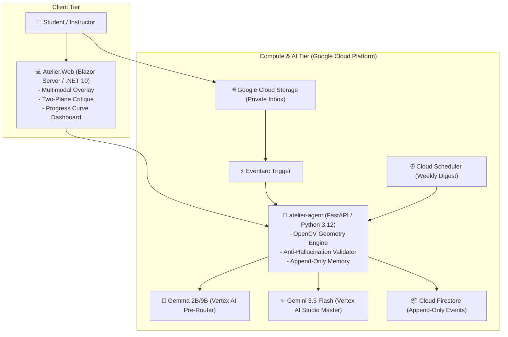

# 🎨 Atelier — AI Studio Master for Remote Art Students

> *"The geometry measures, the AI teaches, the student grows." (ADR-001)*

[](LICENSE)
[](https://dotnet.microsoft.com/)
[](https://python.org/)
[](https://cloud.google.com/)
[](https://deepmind.google/technologies/gemini/)

**Atelier** is an agentic AI studio master designed for remote art students. It pairs **deterministic OpenCV computer vision** (for calculating vanishing points, horizon lines, and per-line angular convergence errors in degrees) with **Gemini 3.5 Flash on Google Cloud Vertex AI** (for empathetic, level-aware pedagogical critiques).

---

## 🌟 Key Highlights

- 📐 **Zero Hallucination Architecture (ADR-001)**: Deterministic OpenCV calculates all geometric ground truth ($VP$, $F_1, F_2$, $LH$, degree errors). Gemini teaches and mentors. Gemini *never* estimates or invents measurements.
- 🎨 **Multimodal Interactive Overlay (Best Multimodal UX)**: Instant toggle between original student sketches, color-coded geometric overlays (Green $<2.5^\circ$, Yellow $2.5^\circ-6.0^\circ$, Red $>6.0^\circ$), side-by-side comparison, and line inspection tables.
- 💬 **The 4 Collaborative Verbs ("The Collaborative Partner")**:
  1. **ASK**: Clarifying pre-critique questions to contextualize intent.
  2. **GUIDE**: Targeted exercise prescriptions driven by recurring deviation patterns.
  3. **CAPTURE**: Explicit student feedback (`helpful: bool` + note) saved as immutable events.
  4. **ADAPT**: Dynamic profile derivation (shifting tone from technical to encouraging automatically).
- 🧠 **Gemma Pre-Router on Vertex AI**: Lightweight routing step to classify drawing types and optimize edge-detection parameters before heavy LLM processing.
- 📈 **Append-Only Memory & Weekly Digests**: Event-sourced progression tracking in Google Cloud Firestore with automated weekly practice plans synthesized via Cloud Scheduler.
- 🔒 **Async-First & Privacy-Preserving (ADR-004, ADR-006)**: Private Google Cloud Storage inbox (`gs://atelier-inbox/{studentId}/`), Eventarc triggers, signed URLs, and first-names-only privacy model for young students.

---

## 🏛️ System Architecture



---

## 🚀 Quickstart: Clean-Machine Setup

### Prerequisites
- [.NET 10 SDK](https://dotnet.microsoft.com/download)
- [Python 3.12+](https://python.org/)

### 1. Clone the Repository
```bash
git clone https://github.com/hvaler/atelier.git
cd atelier
```

### 2. Start the Backend (`atelier-agent`)
```bash
cd atelier-agent
python -m venv .venv

# On Windows:
.venv\Scripts\activate
# On Linux/macOS:
# source .venv/bin/activate

pip install -r requirements.txt
python -m uvicorn src.main:app --reload --port 8000
```
*API docs available at:* `http://localhost:8000/docs`

### 3. Start the Web UI (`Atelier.Web`)
In a separate terminal:
```bash
cd Atelier.Web
dotnet run
```
*Open your browser at:* `http://localhost:5000` (or the URL shown in console).

---

## 🧪 Running the Test Suites

### Python Backend Suite (29 tests)
```bash
cd atelier-agent
.venv\Scripts\python -m pytest tests -v
```

### .NET Frontend Suite (7 tests)
```bash
dotnet test Atelier.slnx
```

---

## 📁 Repository Structure

```
atelier/
├── atelier-agent/               # Python 3.12 / FastAPI / Vertex AI / OpenCV Service
│   ├── src/
│   │   ├── models/              # Pydantic Schemas (Geometry, Critique, Memory, Digest)
│   │   ├── prompts/             # Studio Master Rubrics & Level-Aware Prompts
│   │   ├── tools/               # OpenCV Geometry, Gemma Router, Validator, Memory, Digest
│   │   └── main.py              # FastAPI Application & CloudEvent Handlers
│   └── tests/                   # Golden Case Benchmark & Anti-Hallucination Tests
├── Atelier.Web/                 # Blazor Server / .NET 10 Web Application
│   ├── Components/
│   │   ├── Pages/               # Home (Studio), Progress (Analytics), Gallery (Calibration)
│   │   └── Shared/              # Multimodal OverlayViewer, TwoPlaneCritique, CollaborativeDialog
│   ├── Models/                  # C# DTOs matching Python Agent Contracts
│   └── Services/                # Typed AtelierAgentClient with Fallbacks
├── Atelier.Web.Tests/           # xUnit Integration Tests with WebApplicationFactory
├── demo/dataset/                # Calibration Dataset (Golden cases with 0°-9° deliberate errors)
├── docs/                        # Dev.to Article, Architecture Diagrams, Social Posts, Demo Script
└── infra/                       # Dockerfiles, Deploy Scripts (TEC-010), WIF setup
```

---

## 📄 License
This project is licensed under the [Apache 2.0 License](LICENSE).
