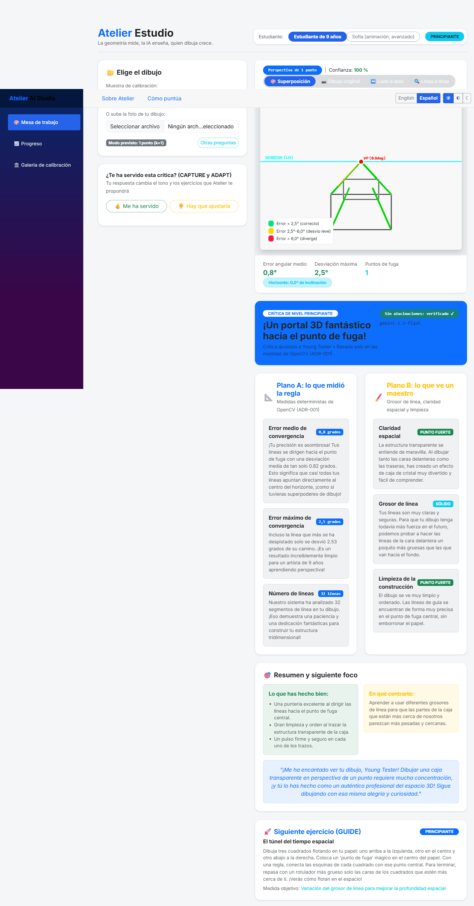

# Atelier — AI Studio Master for Remote Art Students


> *"The geometry measures, the AI teaches, the student grows." (ADR-001)*

[](LICENSE)
[](https://dotnet.microsoft.com/)
[](https://python.org/)
[](https://cloud.google.com/)
[](https://pypi.org/project/google-genai/)
[](https://deepmind.google/technologies/gemini/)

**Atelier** is an agentic AI studio master designed for remote art students. It pairs **deterministic OpenCV computer vision** (for calculating vanishing points, horizon lines, and per-line angular convergence errors in degrees) with **Gemini 3.5 Flash on Google Cloud Vertex AI** (for empathetic, level-aware pedagogical critiques).

---

## ✅ Mandatory Stack Compliance (Hackathon Requirements)

| Requirement | How Atelier satisfies it | Where |
| :--- | :--- | :--- |
| **Gemini 3.5+ via Gemini API or Vertex AI** | Gemini 3.5 Flash on Vertex AI (critique + dialogue) | [`atelier-agent/src/tools/critique.py`](atelier-agent/src/tools/critique.py) |
| **≥1 Google Agent Framework** | Google GenAI SDK (`google-genai`) — every model call | [`atelier-agent/requirements.txt`](atelier-agent/requirements.txt) · [`src/tools/`](atelier-agent/src/tools/) |
| **≥1 Google Cloud infrastructure service** | Cloud Run · Firestore · GCS · Eventarc · Cloud Scheduler | [`infra/`](infra/) · [`src/tools/`](atelier-agent/src/tools/) |

---

## 🌐 Live Demo & Hosted Deployment

- 💻 **Studio Web Client (Blazor / .NET 10)**: `https://atelier-web-773993294789.europe-west1.run.app`
- 🤖 **Agent Backend API (FastAPI / Cloud Run)**: `https://atelier-agent-773993294789.europe-west1.run.app`
- 📚 **Interactive Swagger API Docs**: `https://atelier-agent-773993294789.europe-west1.run.app/docs`

> 💡 *Note on Cold Starts*: To conserve Google Cloud student budget, Cloud Run services scale to 0 instances when idle. The initial load request may take ~5-10 seconds to spin up containers.

---

## What it looks like

Every figure in these screenshots was measured by the deployed system. Nothing is mocked.

### The studio


The drawing on the left is `03_1point_error_9deg.png`, built with a deliberate nine-degree error
on one receding edge. The engine reports **4.5° average, 20.3° worst line** — and selecting the
perfect sample instead reports **0.8° / 2.5°**. The number moves with the drawing, which is the
only interesting property a measurement can have.

The green **Anti-Hallucination: Validated** badge appears only when Gemini actually answered.
When the model is unreachable the same panel shows an amber *"Deterministic fallback — no model
answered"* instead, with the real `model_version` beneath it. The badge is earned per critique,
not painted on.

### When it refuses


A shopping list, uploaded by mistake. Before any measurement, Gemini 3.5 Flash looks at the page
and answers one question: *is this a perspective exercise at all?* Here it is not, and it says
why — *"only repeated lines of text and no perspective drawings or construction lines"*.

**Nothing is measured, and nothing is critiqued.** Without this gate the page would go through
RANSAC, find a vanishing point among whatever edges exist, and spend real tokens telling a child
their line weight is confident. Measuring the wrong thing carefully is worse than declining to
measure it.

### The calibration set


Five synthetic drawings with errors injected at known angles. They are the benchmark the golden
tests assert against: the detector must recover the vanishing point to within one pixel of where
it was drawn, and must rank 0° below 4° below 9°.

### The other projection system


The same page, a different drawing, and a different reference. `07_isometric_error_6deg.png` has
every edge of the X family drawn at 36° instead of 30° — a set square placed wrong, not an unsteady
hand — and the table names exactly that: **nominal 30.0°, measured 36.0°, systematic +6.0°**, while
Y and Z come back at 0.0°.

That split is the point. A single average of 3.1° would say "slightly inaccurate" and leave the
student sanding every edge. Separating *systematic* from *per-line* deviation says something a
published rubric cannot: the hand was steady, the axis was set wrong, and the fix happens once
before drawing rather than edge by edge. Gemini reaches that conclusion from the payload on its
own — *"como todas las líneas de este grupo están desviadas por igual, se trata de un error
sistemático: tu pulso es excelente, solo necesitas ajustar la posición de la regla al empezar"* —
and the critique contains no mention of a vanishing point, because there is no vanishing point in
this drawing and the rubric forbids inventing one.

### The studio, step by step


Three steps — **drawing → context → critique** — with the indicator in the top bar and a rail that
collapses to icons. Step one is choosing: the page analyses nothing until a drawing is picked,
because a three-step flow that starts on step two is not a flow.

Each sample carries the projection system it belongs to, because that decides what it is measured
against. The history beside them is the reader's own: every past exercise with its system, the one
figure worth showing, and the headline of the critique that was written at the time. A figure that
was not measurable renders as a dash — never as zero.

The profile is a **difficulty level**, not a person. It sets the register of the rubric and the tone
of the critique, and nothing downstream interpolates a name into anything.

### The third system: two flat views


Not a picture of a solid at all — a *sistema diédrico* plate: an elevation above the ground line,
a plan below it, and reference lines carrying each vertex across. What is measured here is neither
convergence nor parallelism but **correspondence**: a point in one view must have its counterpart
directly below it in the other.

The plan in this plate is drawn correctly and *placed* 18 px to the right. Every vertex inherits
that, so a naive reading reports four broken corners. Atelier reports one fact —
**systematic offset: 18 px** — removes it, and then checks what is left, which is 1.8 px of
residual and no orphans. The two mistakes it separates need different corrections:

| Reading | What went wrong | What the student does |
|---|---|---|
| Systematic offset, no orphans | The plan was **placed** wrong on the page | Move it once, before anything else |
| Orphan vertex | A corner was **never carried across** the ground line | Redraw the construction |

The hard part of correspondence, in principle, is knowing which mark in the plan belongs to which
vertex in the elevation. The engine never solves it and does not need to: in orthographic
projection corresponding points share an abscissa, so comparing the two views' sets of vertex
abscissae answers the question without pairing a single feature.

**Cotas and alejamientos are not measured.** Those need a third view and real feature
correspondence, and claiming them from two views would be inventing.

### In the student's language



The same drawing, the same measurements, in Spanish and in the light theme. Everything below the
headline was written by Gemini in Spanish because the interface language travels with the request
— the critique is not translated afterwards, and the numbers are the same ones OpenCV produced.
Note `0,8°` rather than `0.8°`: the culture drives number formatting too, so the measurement reads
the way the student writes it.

Metric names, unit words and the strength/needs-attention statuses are identifiers the validator
matches on, so they stay in English on the wire and are looked up for display. An identifier with
no translation falls through to itself, which is readable English rather than a blank.

### The progression


Read from Firestore, not from a fixture. The counts are low because they are real — every
exercise on this page was produced by analysing an actual drawing through the deployed agent.

---

## 🏛️ System Architecture

```text
┌───────────────────────────────────────────────────────────────────────────────────────────┐
│                                   ATELIER STUDIO SYSTEM                                   │
└───────────────────────────────────────────────────────────────────────────────────────────┘
                                              │
                    ┌─────────────────────────┴─────────────────────────┐
                    ▼                                                   ▼
 ┌─────────────────────────────────────┐             ┌─────────────────────────────────────┐
 │       STUDENT WEB CLIENT            │             │      BACKGROUND GCS INGESTION       │
 │  Atelier.Web (Blazor Server .NET10) │             │  gs://atelier-hack-inbox/{studentId}/    │
 │  - Multimodal Overlay (Original/AI) │             │  - Private Family Bucket (ADR-006)  │
 │  - Two-Plane Level-Aware Critique   │             │  - Eventarc Object Finalized        │
 │  - Progress Curve (Native SVG)      │             │  - Cloud Scheduler Weekly Digest    │
 └─────────────────────────────────────┘             └─────────────────────────────────────┘
                    │                                                   │
                    └─────────────────────────┬─────────────────────────┘
                                              ▼
 ┌─────────────────────────────────────────────────────────────────────────────────────────┐
 │            ATELIER AGENT BACKEND (Google GenAI SDK + FastAPI / Cloud Run)               │
 │                                                                                         │
 │   ┌───────────────────────────┐                     ┌───────────────────────────────┐   │
 │   │    Intent Pre-Router      │ ──(Chooses k)─────> │   OpenCV Deterministic Engine │   │
 │   │    (Vertex AI 2B/9B)      │                     │   - Deskew & Hough Lines      │   │
 │   │    - Exercise Classification                    │   - RANSAC Vanishing Points   │   │
 │   │    - Canny Threshold Tuning                     │   - Horizon Line & Error (°)  │   │
 │   └───────────────────────────┘                     │   - Base64 Annotated Overlay  │   │
 │                                                     └───────────────────────────────┘   │
 │                                                                     │                   │
 │                                                                     ▼                   │
 │   ┌───────────────────────────┐                     ┌───────────────────────────────┐   │
 │   │ Anti-Hallucination Gate   │ <──(Validates)───── │   Gemini 3.5 Flash Studio     │   │
 │   │ (ADR-001 Validator)       │                     │   (Google Vertex AI)          │   │
 │   │ - Rejects invented metrics│                     │   - Level-Aware Rubric        │   │
 │   │ - Retries with feedback   │                     │   - Two-Plane Structured JSON │   │
 │   └───────────────────────────┘                     └───────────────────────────────┘   │
 └─────────────────────────────────────────────────────────────────────────────────────────┘
                                              │
                                              ▼
 ┌─────────────────────────────────────────────────────────────────────────────────────────┐
 │                 APPEND-ONLY MEMORY & EVENT STORE (Cloud Firestore)                      │
 │   - students/{studentId}/exercises/{id}      (Immutable geometry & critique)            │
 │   - students/{studentId}/exercises/{id}/feedback/{id} (Helpful bool + note: CAPTURE)    │
 │   - Dynamic Profile Derivation               (Tone adaptation & progress curve: ADAPT)  │
 └─────────────────────────────────────────────────────────────────────────────────────────┘
```

---

## 🌟 Key Highlights

- 📐 **Zero Hallucination Architecture (ADR-001)**: Deterministic OpenCV calculates all geometric ground truth ($VP$, $F_1, F_2$, $LH$, degree errors). Gemini teaches and mentors. Gemini *never* estimates or invents measurements.
- 🎨 **Multimodal Interactive Overlay (Best Multimodal UX)**: Instant toggle between original student sketches, color-coded geometric overlays (Green $<2.5^\circ$, Yellow $2.5^\circ-6.0^\circ$, Red $>6.0^\circ$), side-by-side comparison, and line inspection tables.
- 💬 **The 4 Collaborative Verbs ("The Collaborative Partner")**:
  1. **ASK**: Clarifying pre-critique questions to contextualize intent (*"What were you practicing today? Which part felt hardest?"*).
  2. **GUIDE**: Targeted exercise prescriptions driven by recurring deviation patterns.
  3. **CAPTURE**: Explicit student feedback (`helpful: bool` + note) saved as immutable events.
  4. **ADAPT**: Dynamic profile derivation (shifting tone from technical to encouraging automatically).
- 🧠 **Two-stage pre-router, two models**: **Gemma 4** (`gemma-4-26b-a4b-it`, Gemini API) reads the student's own description and picks 1-point or 2-point — a beginner who writes *"the corner of a building"* is measured as two-point because they said so, not as one-point because of a field in their profile. **Gemini 3.5 Flash** (Vertex AI) then *looks at the photograph* and answers the question that saves the most work: **is this a perspective exercise at all?** A page of text or a blank sheet is refused before the geometry engine runs and before a critique spends tokens describing nothing. Both label their own provenance (`source: gemma | vertex | fallback`).
- 📏 **Two projection systems, and the agent picks which** (`tools/axonometry.py`): conic perspective *and* axonometric — isometric, dimetric, cavalier. The vision gate looks at the photograph and decides which one it is **before** anything is measured, because running a parallel projection through the perspective path finds a vanishing point among edges that were never meant to meet, and then reports an error about it. The second mode is the more trustworthy of the two: perspective has to *estimate* the vanishing point with RANSAC from the student's own lines, so a consistently wrong drawing yields a vanishing point that agrees with it — whereas the axes of an isometric projection are 30°, 90° and 150° **by definition**, so nothing is inferred. An error injected at 6.00° is recovered as 6.00°, asserted to within 0.05° in the golden tests.
- 📐 **Three projection systems, and three kinds of reference** — conic perspective, axonometric (`tools/axonometry.py`) and orthographic Monge plates (`tools/dihedral.py`). The vision gate looks at the photograph and decides which one it is **before** anything is measured. What makes them worth having together is that they are not the same tool three times: **conic infers its reference** (RANSAC estimates a vanishing point from the student's own lines, so a consistently wrong drawing yields one that agrees with it), **orthographic reads its reference off the page** (the ground line is a line the student actually drew — nothing is guessed, but a crooked one skews everything, so its tilt is reported as a measurement in its own right), and **axonometric is handed its reference** as a constant of the system. An error injected at 6.00° in an isometric plate comes back as 6.00°; a plan displaced by 18 px comes back as 18 px.
- 🌍 **Taught in the student's own language**: The interface and the critique are both available in English and Spanish, chosen with one control and remembered in a cookie. This is not a translation layer bolted on top — the language is sent to the agent, so Gemini writes the critique itself in Spanish, and the anti-hallucination gate that forbids a number in Plane B recognises `4,2 grados` as well as `4.2 degrees`. A gate that only reads English would have stopped being a gate the moment the interface was translated.
- 🌗 **Light and dark, decided before first paint**: Three states — light, dark, and follow-the-system, which is the default because a person who has already told their operating system how they want screens to look has answered the question once. The choice is applied by an inline script before the page renders, so there is no flash of the wrong theme.
- 📈 **Append-Only Memory & Weekly Digests**: Event-sourced progression tracking in Google Cloud Firestore with automated weekly practice plans synthesized via Cloud Scheduler.
- 🔒 **Async-First & Privacy-Preserving (ADR-004, ADR-006)**: Private Google Cloud Storage inbox (`gs://atelier-hack-inbox/{studentId}/`), Eventarc triggers, signed URLs, and first-names-only privacy model for young students.

---

## 🔍 Honest Technical Gaps Table (Stripboard Pattern)

In the spirit of radical technical honesty, here is what is 100% implemented versus architectural roadmap:

| Feature / Domain Area | Current Implementation Status | Notes & Roadmap |
| :--- | :--- | :--- |
| **1-Point Perspective ($k=1$)** | ✅ Complete & benchmarked | Golden-case dataset with deliberately injected errors; the detector recovers the vanishing point to within one pixel of where it was drawn. The five calibration images are **synthetic**, generated by `demo/generate_calibration_dataset.py` — there are no photographs of real drawings in this repository. |
| **2-Point Oblique Perspective ($k=2$)** | ✅ **100% Complete & Benchmarked** | RANSAC vanishing point clustering for $F_1$ and $F_2$, horizon tilt, and error per line. |
| **Two-Plane Critique Model** | ✅ **100% Complete & Validated** | Plane A (OpenCV measured) + Plane B (qualitative rubric) strictly separated. Calibrated against published **descriptive-geometry** curricula — the Monge tradition taught in architecture, engineering and animation degrees — across **eighteen sources**. See **[docs/PEDAGOGY.md](docs/PEDAGOGY.md)** for the assessment-criteria comparison, the bilingual canonical vocabulary, and the sourced exercise progression. |
| **Anti-Hallucination Validator** | ✅ **100% Complete & Tested** | In-code gate rejecting fabricated numerical measurements with feedback retry loop. |
| **Collaborative Loop (4 Verbs)** | ✅ **100% Complete** | Ask, Guide, Capture & Adapt with dynamic tone shift and Firestore append-only models. |
| **Two-stage Pre-Router** | ✅ Complete (+0.2 bonus: Gemma) | `/api/router/classify` on Gemma 4, `/api/router/gate` on Gemini 3.5 Flash vision. Gemma's vision path was measured and rejected: it spends its whole output budget reasoning and returns empty. |
| **Async GCS Ingestion (Eventarc + Scheduler)** | ✅ **Verified on GCP (2026-08-18)** | Object finalize triggers Cloud Run pipeline and persists immutable events in Firestore. |
| **Multimodal Blazor UI** | ✅ **100% Complete** | Interactive overlay viewer, side-by-side comparison, and SVG progress curve. |
| **Cylinders & ellipses** | ⏳ *Not measured* | BYU-Idaho's published rubric scores ellipse shape and major/minor axis; Atelier has no ellipse detection. A documented rung of the curriculum ladder ([PEDAGOGY §5](docs/PEDAGOGY.md)) that the engine cannot yet assess, so the agent should not prescribe it. |
| **Interior & exterior scenes** | ⏳ *Untested* | Measurable in principle — an interior is one-point with more orthogonals — but never tested against a real room drawing. Exterior depth is largely atmospheric, which is tonal rather than geometric. |
| **Vertical-line accuracy** | ⏳ *Not scored* | Verticals are correctly excluded from the convergence average, and their deviation from true vertical is not measured. BYU scores it; Atelier does not. |
| **Axonometric projection (isometric, dimetric, cavalier)** | ✅ **Complete & benchmarked** | `POST /api/analyze/axonometric`. Measured against the fixed axes of the system rather than an estimated vanishing point, so the golden case recovers an injected 6° as 6° to within 0.05°. Selected by the vision gate, which distinguishes converging edges from parallel ones before anything is measured. Taught **before** conic perspective in the Spanish public syllabi ([PEDAGOGY §5](docs/PEDAGOGY.md)). |
| **Axonometric exercises in the progression curve** | ⏳ *Deliberately excluded* | Axonometric exercises are stored, critiqued and counted towards tone adaptation, but they do not join the progress curve. An average axis deviation and an average convergence error are both measured in degrees and are not the same quantity; one line through both would show progress or regression nobody made. |
| **Orthographic projection (sistema diédrico / Monge)** | ✅ **Complete & benchmarked** | `POST /api/analyze/dihedral`. Ground-line detection, reference-line squareness, and correspondence between the two views by shared abscissa. A plan displaced by 18 px is recovered as 18 px and reported as one systematic offset rather than one broken vertex per corner. Taught inside the same subject as conic perspective, and **before** it, in the Spanish public syllabi ([PEDAGOGY §5](docs/PEDAGOGY.md)). |
| **Cotas & alejamientos between three views** | ⏳ *Not measured* | Checking that a height in the elevation equals the height in the profile needs a third view and real feature correspondence. Two views cannot support the claim, so it is not made. |
| **3-Point Curvilinear Perspective ($k=3$)** | ⏳ *Planned for Phase 2* | 3-point worm/bird's-eye perspective is planned for high-level architectural rendering. Taught as *perspectiva de plano inclinado* alongside one- and two-point in a Spanish public fine-arts syllabus ([PEDAGOGY §5](docs/PEDAGOGY.md)), so it is the very next documented rung rather than a distant one. |
| **Cast shadows & reflections** | ⏳ *Not measured* | Universidad de Granada devotes a whole block to *"Proyección Caballera. Proyección Militar. Sombras"*. Shadow construction converges on its own points and is geometric, so it is measurable in principle — the engine does not look for it ([PEDAGOGY §3](docs/PEDAGOGY.md)). |
| **Contoured planes (sistema de planos acotados)** | ⏳ *Not measured* | The fourth system of representation: one view plus numeric heights, used for terrain, roofs and earthworks. Reading it needs the annotations off the page — OCR rather than line geometry — so it is the one system of the four Atelier does not cover ([PEDAGOGY §1](docs/PEDAGOGY.md)). |
| **True magnitudes: abatimientos, giros, cambios de plano** | ⏳ *Not measured* | Named in the first block of two published Spanish syllabi. A rabatment either recovers the true length or it does not, so the result is checkable — the engine does not check it ([PEDAGOGY §3](docs/PEDAGOGY.md)). |
| **Measuring points & distance points** | ⏳ *Not measured* | The construction that carries true dimensions into a perspective. A documented rung above where Atelier stops, so the agent must not prescribe it ([PEDAGOGY §5](docs/PEDAGOGY.md)). |
| **Whole-scene layout** | ⏳ *Out of current scope* | Sheridan runs six consecutive semesters of layout and The Animation Workshop teaches *Environment Design and Construction*; Atelier measures one construction at a time ([PEDAGOGY §5](docs/PEDAGOGY.md)). |
| **Live Camera WebRTC Stream** | ⏳ *Planned for Phase 2* | Current version operates on uploaded photos and GCS inbox drops; live video streaming planned. |

---

### What is not done, and what is not proven

A gaps table that only lists roadmap items is a marketing table. These are the things a reviewer
would otherwise have to find:

- **`infra/setup.sh` has not been run against a fresh project.** It now creates the service
  accounts, IAM bindings, Eventarc trigger and Scheduler job that previously existed only because
  somebody typed them once — reproducing, step by step, what the live project contains. But the
  only honest proof is a clean-room run on an empty project, and there has not been one.
- **No application-level authentication.** Both Cloud Run services are `--allow-unauthenticated`
  and the agent has no authorization at all: anyone with the URL can register a student or
  trigger a digest. That is proportionate for a judged demo and wrong for anything else.
- **No signed URLs.** ADR-006 called for them. The current data flow never hands a browser a
  stored object — images travel as base64 over TLS and the bucket is private with uniform
  access — so the control it describes is not needed yet. It becomes required the moment a
  gallery serves stored drawings directly. The ADR is amended rather than quietly dropped.
- **No deskewing.** `preprocess_and_detect_lines` is greyscale, blur, Canny, Hough. A drawing
  photographed at an angle is measured as drawn. Three documents claimed otherwise for a
  fortnight; they no longer do.
- **Gemma does not look at drawings.** Its vision path was measured and rejected: with an image
  attached it returns empty text at 80 and 300 output tokens and does not return at all at 800,
  and `thinking_budget` is unsupported on Gemma. Gemma reads the student's words;
  Gemini 3.5 Flash looks at the page.
- **The two-point case is diagnosed differently from the one-point case.** A consistent rotation
  of every receding edge does not scatter convergence — it lifts one vanishing point off the
  horizon. The measurement that moves is horizon tilt, not average error. This is correct
  perspective, and worth knowing before reading the numbers.

---

## 🚀 Quickstart: Clean-Machine Setup

### Prerequisites
- [.NET 10 SDK](https://dotnet.microsoft.com/download)
- [Python 3.12+](https://python.org/)

### 1. Clone the Repository
```bash
git clone https://github.com/hvaler/atelier.git
cd atelier
```

### 2. Seed the Calibration Benchmark Dataset
```bash
# Windows:
atelier-agent\.venv\Scripts\python demo/generate_calibration_dataset.py
# Linux / macOS:
# python demo/generate_calibration_dataset.py
```

### 3. Start the Backend (`atelier-agent`)
```bash
cd atelier-agent
python -m venv .venv

# Windows:
.venv\Scripts\activate
# Linux/macOS:
# source .venv/bin/activate

pip install -r requirements.txt
python -m uvicorn src.main:app --reload --port 8000
```
*API docs available at:* `http://localhost:8000/docs`

### 4. Start the Web UI (`Atelier.Web`)
In a separate terminal:
```bash
cd Atelier.Web
dotnet run
```
*Open your browser at:* `http://localhost:5000` (or the URL shown in console).

---

## 🧪 Running the Test Suites

All claims are backed by executable tests logged in [`docs/EVIDENCE.md`](docs/EVIDENCE.md).

```bash
# Run Python backend tests (90 tests)
cd atelier-agent
.venv\Scripts\python -m pytest tests -v

# Run .NET Blazor tests (8 tests)
dotnet test Atelier.slnx
```

---

## 📄 License
This project is licensed under the [Apache 2.0 License](LICENSE).
