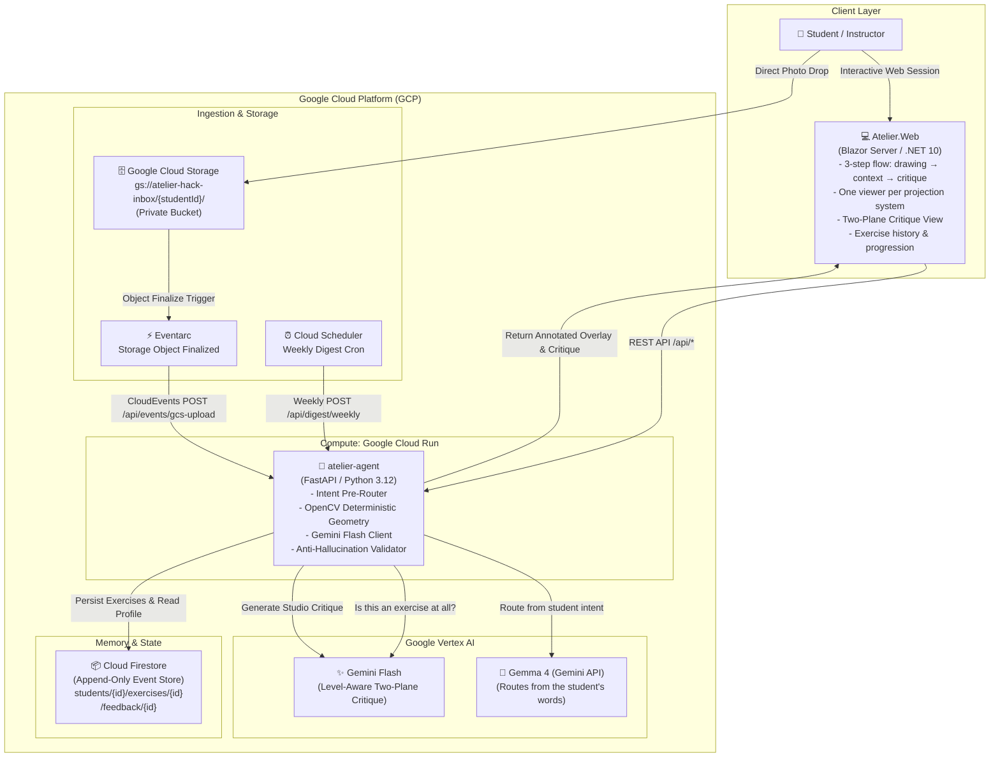
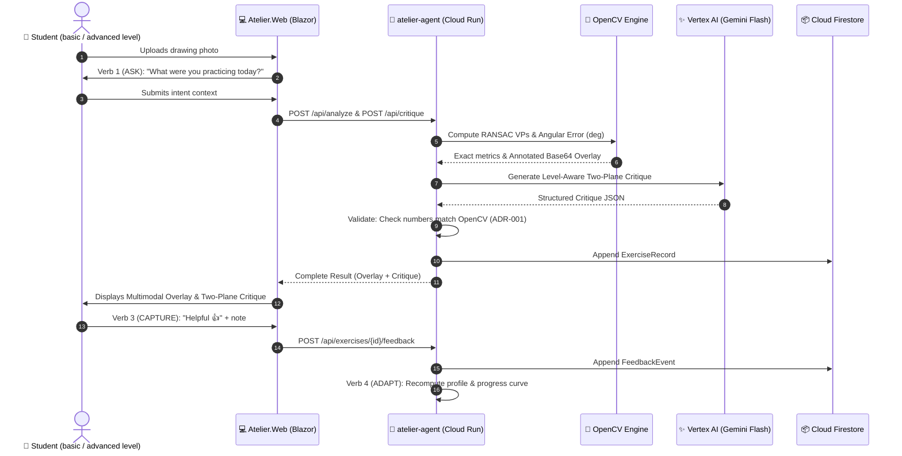

# Atelier — System Architecture & Infrastructure Design

> **Invariants**: ADR-001 (Deterministic OpenCV vs Gemini Pedagogy), ADR-002 (Two-Service Clean Architecture), ADR-003 (Firestore NoSQL Append-Only), ADR-004 (Async Ingestion + Weekly Digest).

---

## 1. High-Level System Architecture

---

## 2. Component Breakdown

### 2.1. `atelier-agent` (Python 3.12 / FastAPI)
- **Deterministic Geometry Engine (`src/tools/geometry.py`)**:
  - Greyscale, Gaussian blur and Canny edge detection via OpenCV. No deskewing: a drawing photographed at an angle is measured as drawn.
  - Probabilistic Hough Transform (`cv2.HoughLinesP`).
  - Pairwise intersection clustering with RANSAC for vanishing point estimation ($k=1$ and $k=2$).
  - Horizon line ($LH$) estimation and angle deviation calculations in degrees ($^\circ$).
  - Generation of Base64 annotated overlays with traffic-light color encoding (Green: $<2.5^\circ$, Yellow: $2.5^\circ - 6.0^\circ$, Red: $>6.0^\circ$).
- **Two-stage pre-router (`src/tools/pre_router.py`)**:
  - `classify_drawing()` — Gemini 3.5 Flash looks at the photograph and answers two questions before anything is measured: *is this an exercise at all*, and *conic, axonometric or orthographic*. That verdict selects which engine runs, because the three measure against unrelated references.
  - `route_from_intent()` — Gemma 4 reads the student's own description and infers which perspective they meant. When it disagrees with the measurement the disagreement is **reported and nothing is changed**: the measurement is evidence, the description is a claim.
  - It does **not** tune Canny thresholds. Those are fixed at 50/150 in `geometry.py`; an earlier version of this document said otherwise and was wrong.
- **Gemini Flash Client (`src/tools/critique.py`)**:
  - Prompts calibrated with real instructor rubrics for formal descriptive-geometry coursework.
  - Level-aware register: `beginner` and `advanced`. The profile is a **difficulty level**, not a person — it decides the vocabulary and tone, and nothing downstream interpolates a name.
  - The critique is written in the student's own language; the language travels with the request rather than being translated afterwards.
- **Anti-Hallucination Validator (`src/tools/validator.py`)**:
  - Enforces ADR-001 by guaranteeing that Plane A (Measured Findings) only contains numbers directly derived from OpenCV. Rejects and retries if fabricated metrics are detected.
- **Append-Only Memory Engine (`src/tools/memory.py` & `collaborative.py`)**:
  - Implements the 4 verbs: **ASK**, **GUIDE**, **CAPTURE**, and **ADAPT**.
  - Dynamically calculates student learning curves and shifts tone based on explicit feedback events.

### 2.2. `Atelier.Web` (.NET 10 / Blazor Server)
- **Multimodal Overlay Component (`Components/Shared/OverlayViewer.razor`)**:
  - Instant toggle between *Annotated Overlay*, *Original Drawing*, *Side-by-Side Split View*, and *Metric Data Table*.
- **Two-Plane Critique Component (`Components/Shared/TwoPlaneCritique.razor`)**:
  - Clear visual demarcation of quantitative measurements (Plane A) vs qualitative instructor feedback (Plane B).
- **Progression Dashboard (`Components/Shared/ProgressChart.razor`)**:
  - Native SVG progress curve showing convergence error reduction over sequential drawings.
  - Weekly 3-day practice prescription plan (Monday, Wednesday, Friday).

---

## 3. Data Flow Diagram (Sync & Async)

