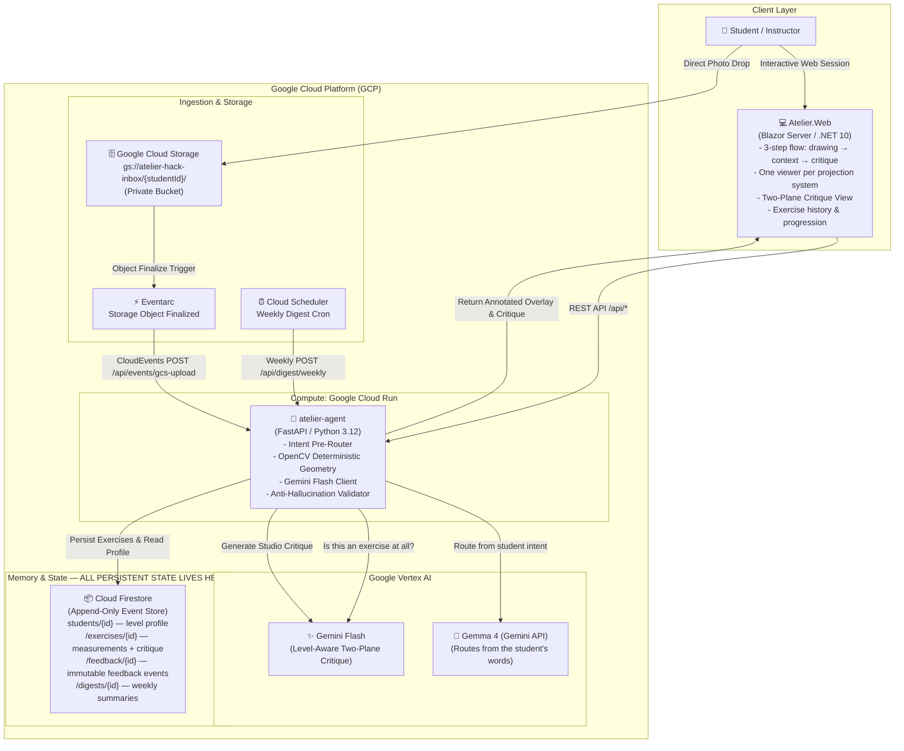
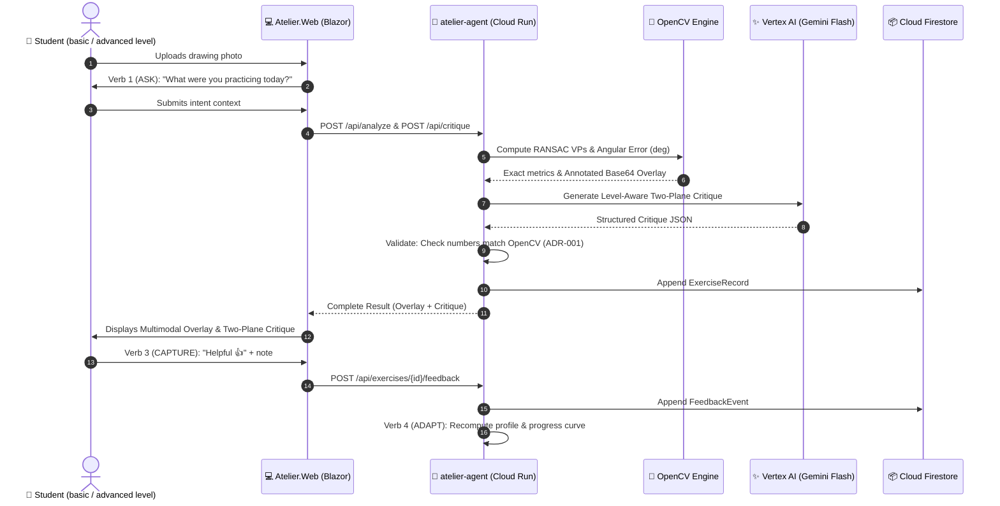

# Atelier — System Architecture & Infrastructure Design

> **Invariants**: ADR-001 (Deterministic OpenCV vs Gemini Pedagogy), ADR-002 (Two-Service Clean Architecture), ADR-003 (Firestore NoSQL Append-Only), ADR-004 (Async Ingestion + Weekly Digest).

---

## 1. High-Level System Architecture

**Where state is stored.** All persistent state is in **Cloud Firestore**, and nowhere else. Neither
service keeps state of its own: `Atelier.Web` holds only the current Blazor circuit, and
`atelier-agent` is stateless between requests — either can be redeployed or scaled to zero mid-session
without losing a student's history. Drawings themselves are transient: uploads arrive as bytes over
HTTP, or land in Cloud Storage for the asynchronous path, and only the measurements and the critique
are persisted.

**Google Cloud services used.** Cloud Run (both services), Firestore (state), Vertex AI (Gemini 3.5
Flash), Gemini API (Gemma 4), Cloud Storage (async inbox), Eventarc (upload trigger), Cloud Scheduler
(weekly digest), Secret Manager (credentials), Artifact Registry (images). Of these, **Cloud Run and
Firestore** are the ones on the hackathon's enumerated list of qualifying infrastructure services.

---

## 2. Component Breakdown

### 2.1. `atelier-agent` (Python 3.12 / FastAPI)

**Three measurement engines, three kinds of reference.** They are not one tool applied three times.
What separates them is where the thing being compared against comes from, and that sets a ceiling on
how far each result can be trusted — so the ranking is documented rather than implied.

- **Conic — `src/tools/geometry.py`** · reference **inferred**:
  - Greyscale, Gaussian blur and Canny edge detection via OpenCV, thresholds fixed at 50/150. No deskewing: a drawing photographed at an angle is measured as drawn.
  - Probabilistic Hough Transform (`cv2.HoughLinesP`).
  - Pairwise intersection clustering with RANSAC for vanishing point estimation ($k=1$ and $k=2$).
  - Horizon line ($LH$) estimation and angle deviation in degrees ($^\circ$).
  - Base64 annotated overlay with traffic-light encoding (green $<2.5^\circ$, amber $2.5$–$6.0^\circ$, red $>6.0^\circ$).
  - **Weakest of the three.** The vanishing point is estimated from the student's own lines, so a consistently wrong drawing produces a reference that agrees with it and the reported error shrinks.
- **Axonometric — `src/tools/axonometry.py`** · reference **given**:
  - Line directions are folded to a doubled-angle circular mean, which is what makes a family's mean direction well defined when its members straddle the wrap-around.
  - Each line is assigned to its nearest axis of the declared system — isometric 30/150/90, dimetric 7/138.58/90, cavalier 0/45/90 — and **nothing is dropped**: a line that fits no family is reported, not discarded.
  - Reports *systematic* deviation (the whole family turned) apart from *per-line* deviation (an unsteady hand). Averaged together they are indistinguishable, and they need opposite corrections.
  - **Strongest of the three.** The axes are constants of the projection system; nothing is estimated.
- **Orthographic** (*sistema diédrico*) — **`src/tools/dihedral.py`** · reference **read off the page**:
  - Detects the ground line, clusters vertex abscissae in each view, and checks correspondence — a point in the plan must sit directly below its counterpart in the elevation.
  - `estimate_systematic_offset()` takes the median of nearest-neighbour deltas and **refuses to report** an offset wider than 25% of the plate: past that it is not a displaced view, it is a failed match.
  - Correspondence never pairs individual features. In orthographic projection corresponding points share an abscissa, so comparing the two sets of abscissae answers the question without solving the pairing problem at all.
  - Aggregates are `float | None`. An average over an empty set renders as a dash, never as `0.00` — a plate whose views do not correspond at all once reported perfect alignment.
- **Two-stage pre-router (`src/tools/pre_router.py`)**:
  - `classify_drawing()` — Gemini 3.5 Flash looks at the photograph and answers two questions before anything is measured: *is this an exercise at all*, and *conic, axonometric or orthographic*. That verdict selects which engine runs, because the three measure against unrelated references.
  - `route_from_intent()` — Gemma 4 reads the student's own description and infers which perspective they meant. When it disagrees with the measurement the disagreement is **reported and nothing is changed**: the measurement is evidence, the description is a claim.
  - It does **not** tune Canny thresholds. Those are fixed at 50/150 in `geometry.py`; an earlier version of this document said otherwise and was wrong.
- **Gemini Flash Client (`src/tools/critique.py`)**:
  - Prompts calibrated with real instructor rubrics for formal descriptive-geometry coursework.
  - Level-aware register: `beginner` and `advanced`. The profile is a **difficulty level**, not a person — it decides the vocabulary and tone, and nothing downstream interpolates a name.
  - The critique is written in the student's own language; the language travels with the request rather than being translated afterwards.
- **Anti-Hallucination Validator (`src/tools/validator.py`)**:
  - Enforces ADR-001 by guaranteeing that Plane A (Measured Findings) only contains numbers directly derived from OpenCV. Rejects and retries if fabricated metrics are detected.
- **Append-Only Memory Engine (`src/tools/memory.py` & `collaborative.py`)**:
  - Implements the 4 verbs: **ASK**, **GUIDE**, **CAPTURE**, and **ADAPT**.
  - Dynamically calculates student learning curves and shifts tone based on explicit feedback events.

### 2.2. `Atelier.Web` (.NET 10 / Blazor Server)

The page is a three-step flow — **drawing → context → critique** — inside a shell whose navigation
rail collapses to icons.

- **`Components/Pages/Home.razor`** — the studio, and the only place that knows which projection system each calibration sample belongs to. It analyses nothing until a drawing is chosen: a three-step flow that begins on step two is not a flow. A `?sample=` deep link from the gallery is the single exception, and it names the drawing it opens.
- **`Components/Shared/StepIndicator.razor`** — the three steps in the top bar, with the current one live.
- **One viewer per projection system**, never two at once:
  - `OverlayViewer.razor` (conic) — toggles *annotated overlay*, *original*, *side-by-side* and *metric table*.
  - `AxonometricViewer.razor` — per-axis table: nominal, measured, systematic deviation, per-line spread.
  - `DihedralViewer.razor` — ground-line tilt, systematic offset, residual, orphan vertices.
- **`TwoPlaneCritique.razor`** — Plane A (measured) and Plane B (studio observations) kept visibly apart, with the provenance badge. Green *Validated* appears only when a model actually answered; otherwise the panel is amber and names the fallback.
- **`ExerciseHistory.razor`** — the reader's own past exercises, read from Firestore: system, the one figure worth showing, and the headline of the critique written at the time. An unmeasurable figure renders as a dash.
- **`ProgressChart.razor`** — native SVG curve over sequential conic exercises, plus the weekly three-day practice plan. Axonometric and orthographic exercises are deliberately **not** plotted on it: an axis deviation and a convergence error are both degrees and are not the same quantity.
- **`CulturePicker.razor` / `ThemeToggle.razor`** — English/Spanish and light/dark. The culture travels with the analysis request, so the critique is *written* in the student's language rather than translated after the fact, and number formatting follows it too (`0,8°`).
- **`CollaborativeDialog.razor`** — the ASK step and the feedback capture that closes the loop.

---

## 3. Data Flow Diagram (Sync & Async)

